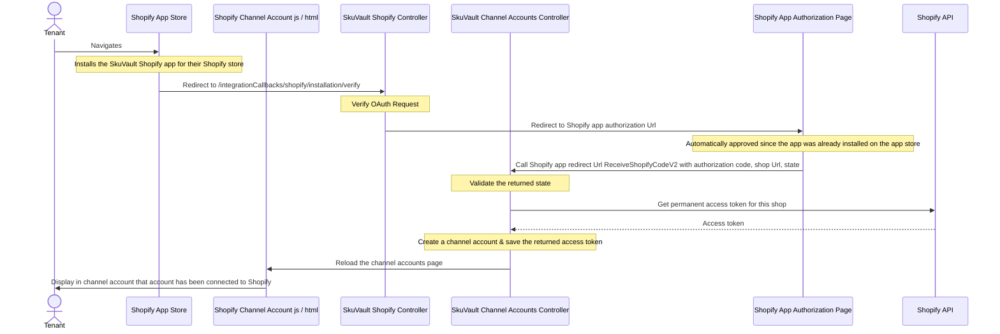

Here is the sequence diagram of Shopify OAuth authorization flow from Shopify App Store to SkuVault Channel Accounts:

```mermaid
sequenceDiagram
    actor Tenant
    Tenant->>Shopify App Store: Navigates
    Note over Shopify App Store: Installs the SkuVault Shopify app for their Shopify store
    participant ChanAcctClient as Shopify Channel Account js / html
    participant ShopifyController as SkuVault Shopify Controller
    participant ChanAcctCtrl as SkuVault Channel Accounts Controller
    Shopify App Store->>ShopifyController: Redirect to /integrationCallbacks/shopify/installation/verify
    Note over ShopifyController: Verify OAuth Request
    participant ShopifyAppAuth as Shopify App Authorization Page
    ShopifyController->>ShopifyAppAuth: Redirect to Shopify app authorization Url
    Note over ShopifyAppAuth: Automatically approved since the app was already installed on the app store
    ShopifyAppAuth->>ChanAcctCtrl: Call Shopify app redirect Url ReceiveShopifyCodeV2 with authorization code, shop Url, state
    Note over ChanAcctCtrl: Validate the returned state
    ChanAcctCtrl->>Shopify API: Get permanent access token for this shop
    Shopify API-->>ChanAcctCtrl: Access token
    Note over ChanAcctCtrl: Create a channel account & save the returned access token
    ChanAcctCtrl->>ChanAcctClient: Reload the channel accounts page
    ChanAcctClient->>Tenant: Display in channel account that account has been connected to Shopify
```
