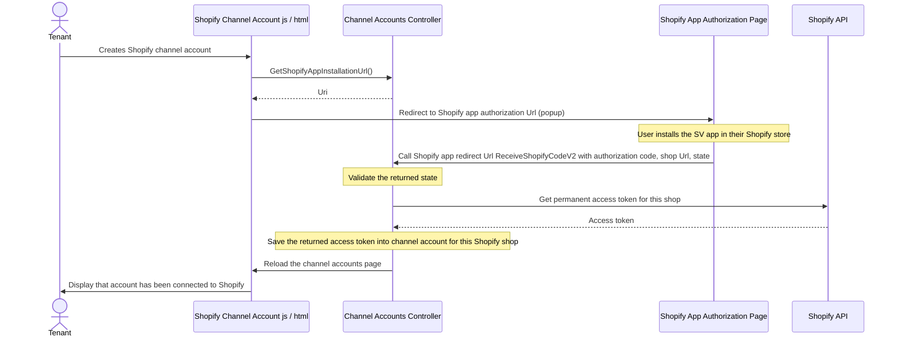

Here is the sequence diagram of Shopify OAuth authorization flow from SkuVault Channel Accounts to Shopfy (and back again):

```mermaid
sequenceDiagram
    actor Tenant
    participant ChanAcctClient as Shopify Channel Account js / html
    Tenant->>ChanAcctClient: Creates Shopify channel account
    ChanAcctClient->>Channel Accounts Controller: GetShopifyAppInstallationUrl()
    participant ShopifyAppAuth as Shopify App Authorization Page
    Channel Accounts Controller-->>ChanAcctClient: Uri
    ChanAcctClient->>ShopifyAppAuth: Redirect to Shopify app authorization Url (popup)
    Note over ShopifyAppAuth: User installs the SV app in their Shopify store
    ShopifyAppAuth->>Channel Accounts Controller: Call Shopify app redirect Url ReceiveShopifyCodeV2 with authorization code, shop Url, state
    Note over Channel Accounts Controller: Validate the returned state
    Channel Accounts Controller->>Shopify API: Get permanent access token for this shop
    Shopify API-->>Channel Accounts Controller: Access token
    Note over Channel Accounts Controller: Save the returned access token into channel account for this Shopify shop
    Channel Accounts Controller->>ChanAcctClient: Reload the channel accounts page
    ChanAcctClient->>Tenant: Display that account has been connected to Shopify
```
